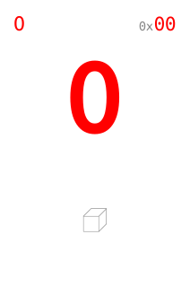
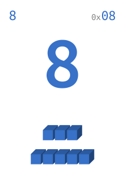
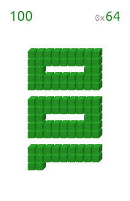
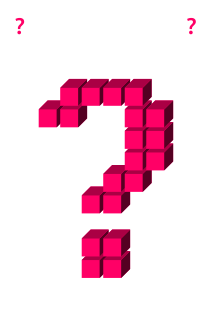

# Ultimate Planning Poker cards
This repo contains a set of [planning poker](https://en.wikipedia.org/wiki/Planning_poker) card SVG images for general use (within the bounds of the [GPLv3 license](LICENSE)), derived from the **Ulimate Planning Poker** deck. The differences with the physical deck, as seen on [Kickstarter](kickstarter.com/projects/michieldewit/scrum-planning-poker-deck-for-8-developers), are:
-  The cards contain no quotes
- The cards contain no random numbers
- The cards contain no playing card symbols
- The rules card and 10X cards were left out

## Available colors

You will find planning poker cards in the following 8 colors:

- Blue
- Green
- Grey
- Orange
- Pink
- Purple
- Red
- Yellow

## Available cards

The cards for each of the colors are in a separate directories. Each directory contains the same set of planning poker cards:

- Zero
- Half
- 1, 2, 3, 5, 8, 13, 20, 40 and 100
- Infinity

In addition, there is a *Coffee* card in the `special` directory.

## Stylesheet

A simple stylesheet is available to help you quickly get started. The stylesheet can be used to set the background image of an element with the appropriate SVG image. It will set the dimensions as well. Check [demo.html](demo.html) for a rudimentary demonstration.

Example:

```html
<card class="planning-poker card-0 red with-border"></card>
```

## About these cards

These cards were generated using a simple PHP script to generate a single HTML file. [Headless Chrome](https://developers.google.com/web/updates/2017/04/headless-chrome) was used to convert the HTML into a PDF. Next, the PDF was split into separate SVG images using [`pdf2svg`](https://github.com/dawbarton/pdf2svg). And finally, the resulting SVG images were optimized using [SVGO](https://github.com/svg/svgo). The resulting SVG-images are small, contain no external dependencies (particularly not on fonts) and scale to whatever size you want.

## Some examples

   